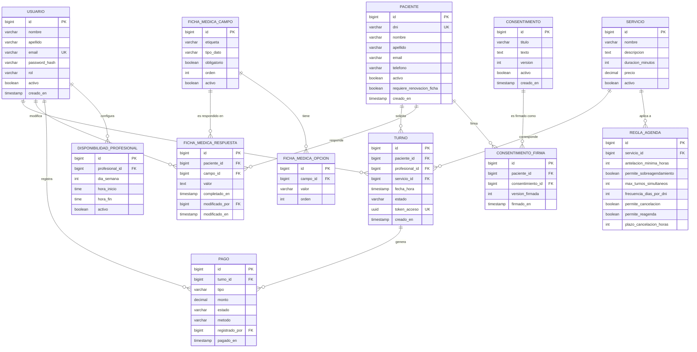

```mermaid
erDiagram
    USUARIO ||--o{ TURNO : "atiende"
    USUARIO ||--o{ FICHA_MEDICA_RESPUESTA : "modifica"
    USUARIO ||--o{ PAGO : "registra"
    USUARIO ||--o{ DISPONIBILIDAD_PROFESIONAL : "configura"

    PACIENTE ||--o{ TURNO : "solicita"
    PACIENTE ||--o{ FICHA_MEDICA_RESPUESTA : "responde"
    PACIENTE ||--o{ CONSENTIMIENTO_FIRMA : "firma"

    SERVICIO ||--o{ TURNO : "corresponde"
    SERVICIO ||--o{ REGLA_AGENDA : "aplica a"

    TURNO ||--o{ PAGO : "genera"

    FICHA_MEDICA_CAMPO ||--o{ FICHA_MEDICA_RESPUESTA : "es respondido en"
    FICHA_MEDICA_CAMPO ||--o{ FICHA_MEDICA_OPCION : "tiene"

    CONSENTIMIENTO ||--o{ CONSENTIMIENTO_FIRMA : "es firmado como"

    USUARIO {
        bigint id PK
        varchar nombre
        varchar apellido
        varchar email UK
        varchar password_hash
        varchar rol
        boolean activo
        timestamp creado_en
    }

    PACIENTE {
        bigint id PK
        varchar dni UK
        varchar nombre
        varchar apellido
        varchar email
        varchar telefono
        boolean activo
        boolean requiere_renovacion_ficha
        timestamp creado_en
    }

    SERVICIO {
        bigint id PK
        varchar nombre
        text descripcion
        int duracion_minutos
        decimal precio
        boolean activo
    }

    DISPONIBILIDAD_PROFESIONAL {
        bigint id PK
        bigint profesional_id FK
        int dia_semana
        time hora_inicio
        time hora_fin
        boolean activo
    }

    TURNO {
        bigint id PK
        bigint paciente_id FK
        bigint profesional_id FK
        bigint servicio_id FK
        timestamp fecha_hora
        varchar estado
        uuid token_acceso UK
        timestamp creado_en
    }

    FICHA_MEDICA_CAMPO {
        bigint id PK
        varchar etiqueta
        varchar tipo_dato
        boolean obligatorio
        int orden
        boolean activo
    }

    FICHA_MEDICA_OPCION {
        bigint id PK
        bigint campo_id FK
        varchar valor
        int orden
    }

    FICHA_MEDICA_RESPUESTA {
        bigint id PK
        bigint paciente_id FK
        bigint campo_id FK
        text valor
        timestamp completado_en
        bigint modificado_por FK
        timestamp modificado_en
    }

    CONSENTIMIENTO {
        bigint id PK
        varchar titulo
        text texto
        int version
        boolean activo
        timestamp creado_en
    }

    CONSENTIMIENTO_FIRMA {
        bigint id PK
        bigint paciente_id FK
        bigint consentimiento_id FK
        int version_firmada
        timestamp firmado_en
    }

    PAGO {
        bigint id PK
        bigint turno_id FK
        varchar tipo
        decimal monto
        varchar estado
        varchar metodo
        bigint registrado_por FK
        timestamp pagado_en
    }

    REGLA_AGENDA {
        bigint id PK
        bigint servicio_id FK
        int antelacion_minima_horas
        boolean permite_sobreagendamiento
        int max_turnos_simultaneos
        int frecuencia_dias_por_dni
        boolean permite_cancelacion
        boolean permite_reagenda
        int plazo_cancelacion_horas
    }
```
